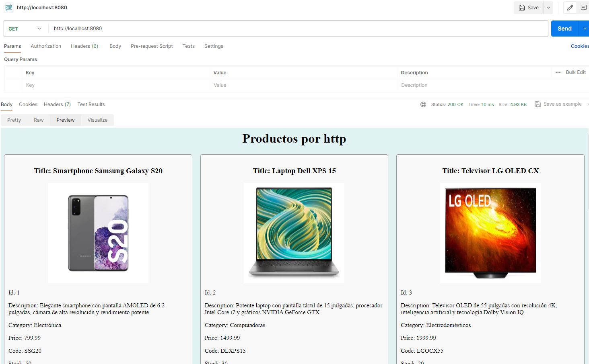
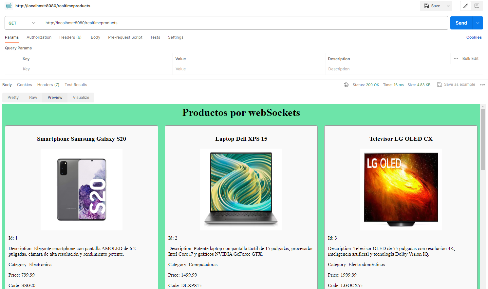

# Desafio - CoderHouse Backend WebSockets

Este proyecto es parte del Desafío Backend 2024 de CoderHouse. Consiste en una aplicación web para gestionar productos en tiempo real mediante HTTP y WebSockets.

## Pasos a seguir

1. **Levantar el servidor**: Ejecute el comando `npm start` para iniciar el servidor.

2. **Acceso a la aplicación**:
   - Para ver los productos mediante HTTP, acceda a: [http://localhost:8080/](http://localhost:8080/)
   - Para ver los productos en tiempo real mediante WebSockets, acceda a: [http://localhost:8080/realtimeproducts](http://localhost:8080/realtimeproducts)

3. **Funcionalidades**:
   - La aplicación permite agregar y eliminar productos en tiempo real mediante HTTP y WebSockets.
   - No se implementó un formulario dentro de `realTimeProducts.handlebars` porque se implementó la conexión de sockets con HTTP.

4. **Conexión de sockets con HTTP**:
   - Se exportó la función `socketServer` desde `app.js` y se importó en `views.router.js` para utilizarla en los métodos POST y DELETE.

5. **Verificación de conexión**:
   - En la consola del servidor, se muestra un mensaje cada vez que un nuevo cliente se conecta, junto con su ID.

## API

La API cuenta con los siguientes métodos:

- **GET**: `/` - Ruta para ver los productos por HTTP.
- **GET**: `/realtimeproducts` - Ruta para ver los productos por WebSockets.
- **POST**: `/realtimeproducts` - Ruta para ingresar un nuevo producto a través de Postman.
- **DELETE**: `/realtimeproducts/:pid` - Ruta para eliminar un producto con un ID específico.

## Capturas de pantalla

    

 

    

